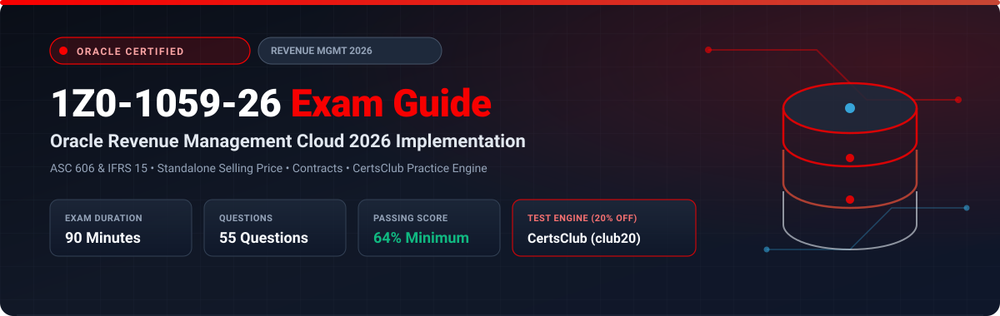

  

# Oracle Revenue Management Cloud 2026 Implementation Professional (1Z0-1059-26) Exam Study Guide & Practice Test Resource Portal

[-f80000?style=for-the-badge&logo=oracle&logoColor=white)](https://education.oracle.com/)

[-28a745?style=for-the-badge&logo=shield)](https://www.certsclub.com/oracle/)

---

## 1. Exam Overview & Candidate Profile

The **Oracle Revenue Management Cloud 2026 Implementation Professional (1Z0-1059-26)** exam validates that an implementation consultant can deploy and configure Oracle Fusion Cloud Revenue Management under modern ASC 606 and IFRS 15 standards. The 2026 exam covers automated contract grouping, Standalone Selling Price (SSP) profile administration, performance obligation templates, variable consideration allocation, and Redwood revenue contract workspaces.

Passing 1Z0-1059-26 grants the **Oracle Revenue Management Cloud 2026 Certified Implementation Professional** credential.

### Target Candidate Profile & Career Roles
* **Revenue Accounting Implementation Consultants**
* **Technical Accounting & Revenue Operations Leads**
* **Financial Compliance & ERP Systems Architects**

---

## 2. Key Exam Specifications

| Parameter | Official Specification |
| :--- | :--- |
| **Exam Code** | 1Z0-1059-26 |
| **Exam Title** | Oracle Revenue Management Cloud 2026 Implementation Professional |
| **Associated Credential** | Oracle Revenue Management Cloud 2026 Certified Implementation Professional |
| **Duration** | 90 Minutes |
| **Number of Questions** | 55 Questions |
| **Passing Score** | 64% |
| **Question Format** | Multiple Choice (Single and Multiple Select) |
| **Delivery Vendor** | Pearson VUE / Oracle University Online Remote Proctoring |
| **Recommended Practice Test Engine** | **[1Z0-1059-26 Practice Test - CertsClub](https://www.certsclub.com/oracle/)** (Coupon: `club20` for 20% off) |

---

## 3. Official Blueprint & Exam Domain Breakdown

| Domain Code | Domain Title | Weighting | Key Competencies Covered |
| :--- | :--- | :---: | :--- |
| **1.0** | **ASC 606 & IFRS 15 Framework in Redwood** | **20%** | Five-step framework, Redwood contract workbench, Integration with Order Management and Receivables. |
| **2.0** | **Contract & Performance Obligation Rules** | **25%** | Automated contract identification, Distinct performance obligations, Obligation templates. |
| **3.0** | **Transaction Price & Standalone Selling Price (SSP)** | **25%** | SSP determination methods (Observed, Residual, Adjusted Market), Relative price allocation. |
| **4.0** | **Satisfaction Methods & Revenue Schedules** | **20%** | Point-in-time satisfaction, Over-time percentage-of-completion schedules, Contract asset/liability netting. |
| **5.0** | **Period Close & Revenue Accounting Disclosures** | **10%** | Validate Customer Contracts, Revenue Subledger Accounting rules, IFRS 15 disclosure reporting. |

---

## 4. Scenario-Based Demo Question & Explanation

### Question 1: Contract Modification Accounting
**Scenario:** A company enters into a 2-year service contract. After 1 year, the client requests additional distinct services at a price that reflects the standalone selling price of those services.

How should this contract modification be accounted for in Oracle Revenue Management?

A) Cumulative catch-up adjustment on the existing contract  
B) As a **separate prospective contract**  
C) Cancel the existing contract and create a new one  
D) Void the invoice in Receivables  

**Correct Answer:** **B**

**Detailed Explanation:**
* Under ASC 606 and IFRS 15, if a contract modification adds distinct goods or services priced at their Standalone Selling Price (SSP), it is accounted for prospectively as a separate, distinct contract without adjusting previously recognized revenue on the initial contract.

---

## 5. Recommended Preparation Strategy & Practice Testing Engine

1. **Test Contract Modifications in Redwood:** Configure SSP profiles and test prospective contract adjustments.
2. **Practice with Full-Length Mock Exams:** Use **[CertsClub Oracle 1Z0-1059-26 Practice Tests](https://www.certsclub.com/oracle/)**.
   * Up-to-date with 2026 objectives and scenario-based questions.
   * Enter discount coupon code **`club20`** at checkout on [CertsClub](https://www.certsclub.com/oracle/) for an immediate 20% discount.

---

## 6. Official Documentation & References

* [Oracle Financials Cloud Revenue Management 2026 Documentation](https://docs.oracle.com/en/cloud/saas/financials/revenue-management/)
* [Oracle University 1Z0-1059-26 Exam Details](https://education.oracle.com/)
* [CertsClub 1Z0-1059-26 Practice Engine](https://www.certsclub.com/oracle/)
